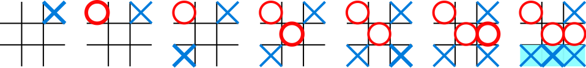

# Tic-Tac-Toe
Tic-Tac-Toe Game built with Ruby

## What is Tic-Tac-Toe?

Tic-tac-toe (American English), noughts and crosses (British English), or Xs and Os is a paper-and-pencil game for two players, X and O, who take turns marking the spaces in a 3×3 grid. The player who succeeds in placing three of their marks in a horizontal, vertical, or diagonal row is the winner.

## How to Win?

In order to win the game, a player must place three of their marks in a horizontal, vertical, or diagonal row.

## How to run the Game?

* Make sure you have Ruby in your system or [play here](https://repl.it/@mohammadumar28/my-tic-tac-toe) online
* Clone this project or download it
* Go to the cloned or downloaded directory
* Run `bin/main.rb` in the terminal/command line
* Start playing!

## Live Version

[Live Link](https://repl.it/@mohammadumar28/my-tic-tac-toe) :clap:

## Prerequisites

* Ruby (v2.7)
* RSpec

## Instructions to Test the Project

* Clone the repository
* cd in to the cloned directory
* Switch to testing branch by `git checkout rspec-testing`
* Run `bundle install`
* Run `rspec`

## Authors
**Muhammad Umar**

- Github: [@mohammadumar28](https://github.com/mohammadumar28)
- LinkedIn: [Muhammad Umar](https://www.linkedin.com/in/mohammadumar28/)
- Twitter: [@Mohammadumar28](https://twitter.com/Mohammadumar28)

**Marshall Akpan**

- Github: [@uimarshall](https://github.com/uimarshall)
- LinkedIn: [Marshall Akpan](https://www.linkedin.com/in/marshall-akpan-19745526/)
- Twitter: [@uimarshall](https://twitter.com/uimarshall)

## Acknowledgments

- The Odin Project
